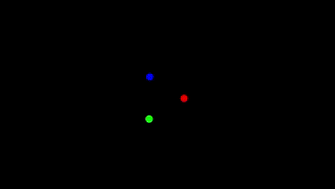
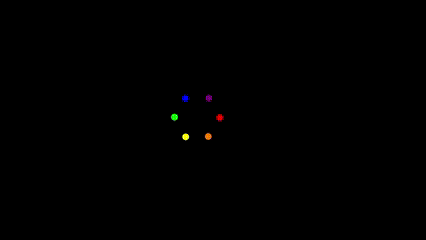
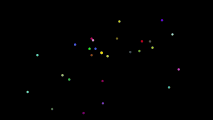
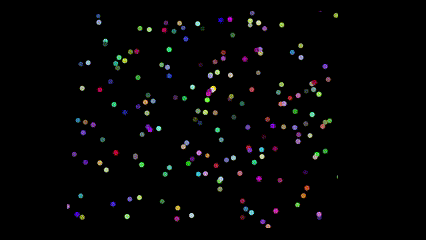

# N-Body Simulation
 Simulating the dynamics of several bodies moving simultaneously under the influence of gravitational forces in 2D. It includes both sequential and parallel implementations, along with a real-time GTKMM GUI for visualization.

## Files Overview

- **nbody.hpp** :  Delares the **`Body`**  structure; the **`Quad`**  and **`QuadNode`** classes for Barnes-Hut; and the **`NBodySimulation`** class with all simulation methods (sequential, parallel, and Barnes-Hut).
- **nbody.cpp** : Implements the simulation logic:
  - Time-step update (sequential and parallel)
  - Force computations (sequential and parallel), including:
    - A direct parallel approach using atomics
    - A direct parallel approach using thread-local arrays
    - The parallel Barnes-Hut algorithm
- **sim.cpp** : Starts the GUI using GTKMM and allows switching between simulation modes (solar system, 3-body and 6-body problems, N random bodies, etc.). Particles are rendered live in a sequential manner because Cairo, the rendering library, is not thread-safe. However, the particle data is updated concurrently in parallel threads to improve responsiveness. Also implements the accuracy and efficiency analyses.

## How to Run
### 1. Prerequisites
Make sure you have:
- A **C++20**-compatible compiler
- **GTKMM 3** library
### 2. Build the Project
Download all the source files into a single directory and compile using: `make`
### 3. Run the Simulation
Run the simulation as follows:
  - **`./nbody`** or **`./nbody -sim1`** to simulate the solar system (by default)
  - **`./nbody -sim3`** to simulate a 3-body problem
  - **`./nbody -sim6`** to simulate a 6-body problem
  - **`./nbody -rand N`** to simulate a random system with N bodies
  - **`./nbody -comp`** to test accuracy
  - **`./nbody -eff N`** to test efficiency with N random bodies
  - **`./nbody -help`** to see all call options

## GUI Controls and Interactive Features

Once the simulation window opens, you can interact with the system in real time using:

- **Spacebar**: Pause/Resume the simulation
- **+ / -** or **Zoom In / Zoom Out buttons**: Zoom into or out of the simulation view
- **Mouse Drag**: Click and drag with the left mouse button to pan the simulation view
- **Up / Down Arrow Keys** or **Faster / Slower buttons**: Increase or decrease the timestep (i.e., simulation speed)
- **R or Reset button**: Reset the simulation to its initial state

## Simulation Preview

### Solar System

### 3-Body Triangle

### 6-Body Hexagon

### 50 Random Bodies

### 500 Random Bodies

### 5000 Random Bodies

